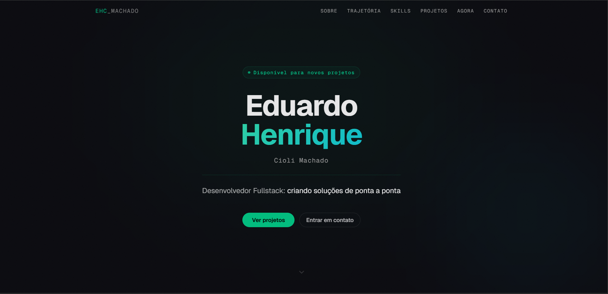

# 🖥️ Eduardo Machado — Portfólio Pessoal

> Portfólio pessoal desenvolvido com Next.js 16, TypeScript e shadcn/ui.  
> 🔗 **[eduardomachado.vercel.app](https://eduardomachado.vercel.app)**




---

## 📋 Sobre o projeto

Site de portfólio pessoal com dark mode, animações com GSAP e ScrollTrigger, e foco em performance, atingindo **100 pontos em todas as categorias do PageSpeed Insights**.

O site apresenta minha trajetória, stack técnico, projetos desenvolvidos e canais de contato.

---

## 🚀 Seções

- **Hero** — apresentação com call to action
- **Sobre** — resumo profissional e estatísticas
- **Trajetória** — linha do tempo da minha carreira
- **Skills** — tecnologias que utilizo
- **Projetos** — projetos desenvolvidos com links para o GitHub
- **Atualmente** — o que estou estudando no momento
- **Contato** — canais de comunicação

---

## 🛠️ Stack do projeto

| Tecnologia | Uso |
|---|---|
| Next.js 16 | Framework React com App Router |
| React 19 | Biblioteca de UI |
| TypeScript 5.7 | Tipagem estática |
| Tailwind CSS v4 | Estilização |
| shadcn/ui | Componentes de UI |
| GSAP + ScrollTrigger | Animações |
| Vercel Analytics | Monitoramento |
| Vercel | Deploy e hospedagem |

---

## 💻 Como rodar localmente

**Pré-requisitos:** Node.js 18+ instalado

```bash
# Clone o repositório
git clone https://github.com/MachadoEduardo/MyPort

# Entre na pasta
cd meu-portfolio

# Instale as dependências
npm install

# Rode em modo de desenvolvimento
npm run dev
```

Acesse [http://localhost:3000](http://localhost:3000) no navegador.

---

## 📦 Scripts disponíveis

```bash
npm run dev      # Inicia o servidor de desenvolvimento
npm run build    # Gera o build de produção
npm run start    # Inicia o servidor de produção
npm run lint     # Verifica erros de lint
```

---

## 📁 Estrutura do projeto

```
├── app/
│   ├── layout.tsx        # Layout raiz com metadados e SEO
│   ├── page.tsx          # Página principal do portfólio
│   └── globals.css       # Estilos globais
├── components/
│   └── ui/               # Componentes shadcn/ui
├── lib/
│   └── utils.ts          # Utilitários (cn)
├── public/               # Arquivos estáticos e ícones
└── hooks/                # Hooks customizados
```

---

## 📬 Contato

- **E-mail:** 05eduardomachado@gmail.com
- **LinkedIn:** [linkedin.com/in/eduardohcm](https://linkedin.com/in/eduardohcm)
- **WhatsApp:** (42) 99818-2986

---

<p align="center">Feito com Next.js + shadcn/ui por Eduardo Henrique Cioli Machado</p>
